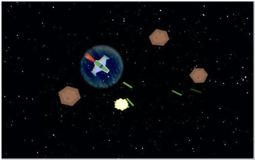

# Game: Space Rocks

The player controls a spaceship , whose goal is to shoot lasers and destroy rocks that are flying around the screen.

**Controls**

- **UP** key: accelerate spaceship
- **LEFT and RIGHT** keys: rotate spaceship
- **SPACE BAR**: fire the laser
- **X** key: teleportation

## Setup

- **Kotlin** 1.6.21
- **JVM** 11
- **Gradle** Wrapper 7.4.2
- **LigKTX** 11.11.0-rc1: https://libktx.github.io
- **LigGDX** 1.11.0: https://libgdx.com
- **Fleks ECS Library**: https://github.com/Quillraven/Fleks
- **GDX Liftoff** https://github.com/tommyettinger/gdx-liftoff

## Disclaimer

This "game" is the result of reading, studying and learning the examples shown in the book "**Java Game Development
with LibGDX**" by the author Lee Stemkoski.

- **Book site**: https://www.apress.com/gp/book/9781484233238
- **Source-code**: https://github.com/Apress/java-game-dev-LibGDX